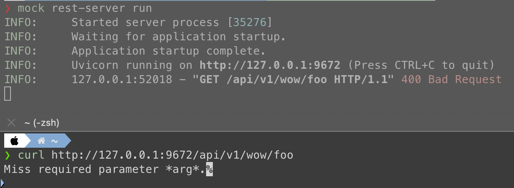

# Request

## ``mocked_apis.<API name>.http.request``

This section is responsible for all settings of HTTP request.


### ``method``

The HTTP method which be accepted by API.


### ``parameters``

The parameter settings of API.


#### ``parameters[*].name``

The name of parameter.

Example of usage:

=== "HTTP method is GET"
    
    ```yaml hl_lines="7-8"
    mocked_apis:
      foo_home:
        url: '/foo-home'
        http:
          request:
            method: 'GET'
            parameters:
              - name: 'arg1'
    ```

=== "HTTP method is POST"
    
    ```yaml hl_lines="7-8"
    mocked_apis:
      foo_home:
        url: '/foo-home'
        http:
          request:
            method: 'POST'
            parameters:
              - name: 'arg1'
    ```

Then you could use the parameter ``arg1`` of API ``/foo-home``.

=== "Send HTTP request by GET method"
    
    ```console
    curl -X GET http://127.0.0.1:9672/foo-home?arg1=value
    ```

=== "Send HTTP request by POST method"
    
    ```console
    curl -X POST http://127.0.0.1:9672/foo-home -H 'Content-Type: application/json' -d '{"arg1":"value"}'
    ```


#### ``parameters[*].required``

This is a boolean type value. If it's ``true``, web server would respond 400 error if the request misses the argument. Nor
it would ignore it.

!!! tip "If insisting on requesting without required parameter ..."

    If you set a request parameter as required and you insisting
    on requesting without it, server would reutnr a 400 response
    with invalid message:

    


#### ``parameters[*].default``

The default value of parameter. If the parameter in request is empty or ``None`` value, it would use this value to process.


#### ``parameters[*].type``

The data type of the parameter value API should accept. The setting value should be a valid type for Python realm, i.e.,
string type value as ``str``, integer type value as ``int``, etc. 

Please refer to [Python built-in types](https://docs.python.org/3/library/stdtypes.html) document to get more detail if
you need.

!!! note "What data type you should use?"

    As the description mention, the data type should be vallid for Python realm. Here provides some data type to help you
    configure your API parameters.
    
    * Text type value: ```str```
    * Integer type value: ```int```
    * Boolean type value: ```bool```
    * Some object of list type value: ```list```
    * Key-value map type value: ```dict```


#### ``parameters[*].format``

A regular expression of parameter value API should accept. It would respond 400 error if the parameter value format is not
satisfied.

About the setting details, please refer to [here](./common/value_format.md).


#### ``parameters[*].items``

If the data type of parameter value is list type, it should use this key to configure its element details. The element detail 
follow [item element settings](/configure-references/mocked-apis/apis/http/common/item_element).
